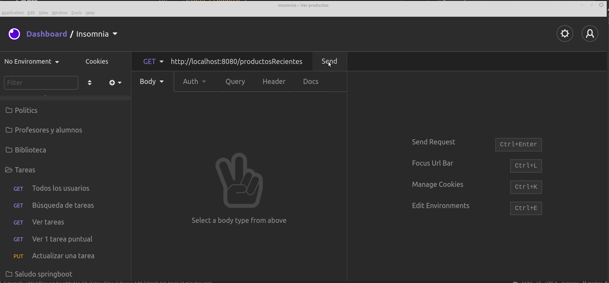

# Productos (problema N + 1 queries)

[](https://github.com/uqbar-project/eg-products-springboot-kotlin/actions/workflows/build.yml) [](https://codecov.io/gh/uqbar-project/eg-products-springboot-kotlin)

Este ejemplo permite ver el problema de los (N + 1) queries. Consiste en un servicio REST hecho con Spring Boot, que tiene un solo endpoint: el que permite consultar los productos más recientes.

## Dominio

Tenemos productos y fabricantes, que cumplen una relación many-to-many: un producto tiene muchos fabricantes y un fabricante ofrece muchos productos. No hay relación en cascada: el producto y el fabricante tienen ciclos de vida separados.

## Generación del juego de datos

La clase **ProductosBootstrap** genera el juego de datos inicial cuando no hay fabricantes:

- construye una lista de 25 fabricantes
- y 5000 productos: a la mitad les pone los primeros 10 fabricantes y a la otra mitad les asigna los fabricantes ubicados en las posiciones 11, 12, 13, 14 y 15

## Endpoint que trae los productos recientes

El único endpoint que publica el web server es `/productosRecientes`, que implementa el método GET:

```kt
@GetMapping("/productosRecientes")
@ApiOperation("Trae la información de los últimos productos cargados.")
fun buscarProductosRecientes() =
    productoRepository
        .findAll(PageRequest.of(0, 1000, Sort.Direction.ASC, "fechaIngreso"))
        .map { ProductoDTO.fromProducto(it) }
```

Dado que tenemos una gran cantidad de productos, decidimos paginar los resultados que envía el repositorio: `.findAll(PageRequest.of(0, 5, Sort.Direction.ASC, "fechaIngreso"))` trae los primeros 5 resultados ordenados por fecha de ingreso en forma ascendente. Para poder trabajar con paginación debemos definir el repositorio extendiendo de la interfaz `PagingAndSortingRepository`:

```kt
interface ProductoRepository : PagingAndSortingRepository<Producto, Long> {
```

## Configuración EAGER

Podemos ver cómo está definido el mapeo del objeto de dominio Producto:

```kt
@Entity
class Producto {

    @Id
    @GeneratedValue(strategy = GenerationType.AUTO)
    var id: Long? = null

    ...
    
    @JsonIgnore
    @ManyToMany(fetch = FetchType.EAGER)
    var proveedores: Set<Fabricante> = mutableSetOf()
```

Mmm... si los proveedores se anotan con FetchType EAGER, esto significa que cada vez que tomemos los datos de un producto también estaremos trayendo los proveedores. Si en el controller permitimos paginar 1000 elementos, vamos a ver que **efectivamente resulta un problema** esta configuración. Hagamos la llamada a la API:

```bash
http://localhost:8080/productosRecientes
```

o bien en Swagger o Insomnia:


Como pueden ver tenemos

- un primer query que trae todos los productos

```sql
-- Hibernate: query del producto  
    select
        producto0_.id as id1_1_,
        producto0_.fechaIngreso as fechaIng2_1_,
        producto0_.nombre as nombre3_1_ 
    from
        Producto producto0_ 
    order by
        producto0_.fechaIngreso asc limit ?
```

- y por cada producto, un query que baja la información de sus fabricantes (el temido **n**, la lista de productos que paginados pueden ser 5... o 1000)

```sql
-- Hibernate: query 1 del fabricante 
    select
        proveedore0_.Producto_id as Producto1_2_0_,
        proveedore0_.proveedores_id as proveedo2_2_0_,
        fabricante1_.id as id1_0_1_,
        fabricante1_.nombre as nombre2_0_1_ 
    from
        Producto_Fabricante proveedore0_ 
    inner join
        Fabricante fabricante1_ 
            on proveedore0_.proveedores_id=fabricante1_.id 
    where
        proveedore0_.Producto_id=?
```

## Lazy es la solución... o casi

Podemos pensar entonces que si configuramos la relación producto-fabricantes como lazy, habremos resuelto nuestro problema:

```kt
@Entity
class Producto {
    ...

    @JsonIgnore
    @ManyToMany(fetch = FetchType.LAZY)
    var proveedores: Set<Fabricante> = mutableSetOf()
```

Pero si volvemos a levantar la aplicación, nos vamos a llevar una sorpresa no muy grata:



El mensaje de error es bastante claro:

```bash
org.hibernate.LazyInitializationException: 
  failed to lazily initialize a collection of role: ar.edu.unsam.productos.domain.Producto.proveedores,
  could not initialize proxy - no Session
  ...
  at ar.edu.algo3.products.domain.Producto.getNombresDeProveedores(Producto.kt:30)
```

El problema está en que los proveedores son una colección _lazy_ en producto, y que tenemos la configuración

```yml
open-in-view: false
```

Esto hace que la sesión se cierre

- en el service cuyo método se demarca con la anotación @Transactional (sea read-only o no)
- o bien en este caso dentro del método del ProductoRepository

es decir, que en el momento en que el controller quiere serializar a JSON la respuesta del endpoint, ya no tenemos una sesión abierta y se lanza la excepción.

Cambiar la configuración a

```yml
open-in-view: true
```

que es la opción por defecto de Springboot no mejora nuestro problema, volvemos a tener el mismo comportamiento que en el primer caso (con la configuración EAGER), porque **en la serialización a JSON estamos yendo a buscar los proveedores por cada uno de los productos**.

## Entity Graph to the rescue

La configuración lazy es parte de la solución, pero debemos ajustar nuestro query para que los productos recientes los resuelva haciendo JOIN hacia la tabla de fabricantes **en la misma consulta**. Así evitamos el problema de los (n + 1) queries:

```kt
interface ProductoRepository : PagingAndSortingRepository<Producto, Long> {

    @EntityGraph(attributePaths=[
        "proveedores"
    ])
    override fun findAll(pageable: Pageable): Page<Producto>
```


Ahora sí, al disparar la consulta nuevamente, se resuelve todo en un único query:

```sql
Hibernate: 
    select
        producto0_.id as id1_1_0_,
        fabricante2_.id as id1_0_1_,
        producto0_.fechaIngreso as fechaIng2_1_0_,
        producto0_.nombre as nombre3_1_0_,
        fabricante2_.nombre as nombre2_0_1_,
        proveedore1_.Producto_id as Producto1_2_0__,
        proveedore1_.proveedores_id as proveedo2_2_0__ 
    from
        Producto producto0_ 
    inner join
        Producto_Fabricante proveedore1_ 
            on producto0_.id=proveedore1_.Producto_id 
    inner join
        Fabricante fabricante2_ 
            on proveedore1_.proveedores_id=fabricante2_.id 
    order by
        producto0_.fechaIngreso asc
```

Aun cuando hay que traer 1000 productos, la deserialización de la base hacia el modelo de objetos en la JDK y el posterior render a JSON tarda bastante menos, pero sobre todo, no perjudicamos a la base haciendo 1001 consultas.

## Cómo testear la aplicación en Insomnia

Te dejamos [el archivo de Insomnia](./Products_Insomnia.json) con ejemplos para probarlo.

## Links relacionados

- [How to detect the n+1 query problem during testing](https://vladmihalcea.com/how-to-detect-the-n-plus-one-query-problem-during-testing/)
- [JPA Tips: avoiding the n+1 select problem](https://www.javacodegeeks.com/2018/04/jpa-tips-avoiding-the-n-1-select-problem.html)
- [What is the solution for the n+1 issue in JPA and Hibernate](https://stackoverflow.com/questions/32453989/what-is-the-solution-for-the-n1-issue-in-jpa-and-hibernate)

